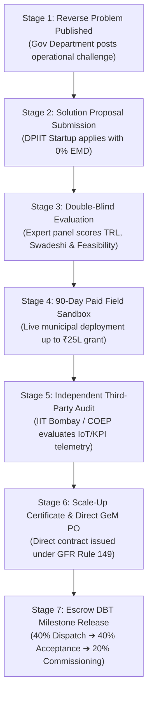

# 🏛️ Maharashtra StartupSetu (Innovation Procurement Portal - IPP)
### *Bridging Deep-Tech Innovation and Public Governance Under GFR 149 & Maharashtra Innovation Policy 2026*

---

## 📑 Table of Contents
1. [Executive Summary & Project Aim](#1-executive-summary--project-aim)
2. [Problem Statement & Public Procurement Bottlenecks](#2-problem-statement--public-procurement-bottlenecks)
3. [The Solution: 7-Stage Innovation Procurement Lifecycle](#3-the-solution-7-stage-innovation-procurement-lifecycle)
4. [High-Level System Architecture](#4-high-level-system-architecture)
5. [Autonomous 4-Agent AI Engine & Assistive RAG](#5-autonomous-4-agent-ai-engine--assistive-rag)
6. [Multi-Role RBAC & Portals (6 Distinct Stakeholders)](#6-multi-role-rbac--portals-6-distinct-stakeholders)
7. [Comprehensive Technology Stack](#7-comprehensive-technology-stack)
8. [Database Schema & Entity Architecture (28 Tables)](#8-database-schema--entity-architecture-28-tables)
9. [Complete REST API Architecture (11 Controllers)](#9-complete-rest-api-architecture-11-controllers)
10. [Repository & Directory Structure](#10-repository--directory-structure)
11. [Statutory, Legal & Policy Compliance](#11-statutory-legal--policy-compliance)
12. [Bilingual Localization (English & Marathi)](#12-bilingual-localization-english--marathi)
13. [Local Development, Setup & Deployment Guide](#13-local-development-setup--deployment-guide)
14. [Demo Credentials & 1-Click Evaluation Matrix](#14-demo-credentials--1-click-evaluation-matrix)

---

## 1. Executive Summary & Project Aim

**StartupSetu (Innovation Procurement Portal - IPP)** is an enterprise-grade digital platform engineered for the **Government of Maharashtra (Maharashtra State Innovation Society - MSInS)**. Its core mission is to institutionalize **Direct Startup-to-Government Procurement** under **General Financial Rules (GFR) Rule 149, Rule 173(i), and the Maharashtra State Innovation Policy 2026**.

### 🎯 Primary Project Aims:
1. **Dismantle Legacy Procurement Barriers**: Enable DPIIT-recognized, early-stage deep-tech startups to compete for public contracts without prohibitive pre-qualification hurdles.
2. **Reverse Problem Statement Mechanism**: Allow state departments and municipal corporations to post real civic and administrative challenges, inviting verified startups to propose cutting-edge solutions.
3. **De-Risk Government Adoption via 90-Day Sandboxes**: Implement milestone-linked, paid field pilots (up to ₹25 Lakhs) where innovations are tested in live municipal environments with real sensor/telemetry tracking.
4. **Third-Party Independent Verification**: Enforce impartial audit protocols through premier institutions (IIT Bombay, COEP, VJTI) before commercial scale-up.
5. **Direct GeM Commercial Contracting & Escrow DBT**: Issue statutory GeM-compliant direct purchase orders with milestone-linked Direct Benefit Transfer (DBT) escrow releases (40% - 40% - 20%).
6. **Bilingual Accessibility**: Full localization in **English** and **Marathi (मराठी)** to empower grassroots administration across all 36 districts of Maharashtra.

---

## 2. Problem Statement & Public Procurement Bottlenecks

Traditional public sector tendering creates an unintentional monopoly for large legacy contractors, locking out early-stage innovation:

| Legacy Procurement Barrier | Impact on Startups | How StartupSetu Solves It |
| :--- | :--- | :--- |
| **Mandatory 3+ Years Financial Turnover** | Excludes high-potential startups incorporated under 3 years. | **GFR 149 Exemption**: Eliminates prior turnover and track-record rules for DPIIT startups. |
| **Earnest Money Deposit (EMD) & PBG** | Locks 2%–10% of tender value in bank guarantees, draining startup runway. | **100% EMD Waiver**: Complete waiver of tender fees and earnest deposits for verified startups. |
| **Rigid RFP Technical Criteria** | Legacy tenders specify exact brands or outdated equipment. | **Reverse Problem Statements**: Focuses on the *problem outcome* rather than prescriptive legacy specs. |
| **High Deployment Risk for Departments** | Fear of purchasing unproven technology at full contract scale. | **90-Day Paid Sandbox**: Milestone-funded pilot sandbox testing in actual municipal wards. |
| **Tender Fraud & Shell Companies** | Fake MSME certificates and fraudulent bid claims. | **Autonomous AI DPIIT Verification**: Real-time validation against central databases. |
| **Delayed Payment Cycles** | Startups wait 6–18 months for bureaucratic invoice approvals. | **Escrow DBT Disbursements**: Milestone-triggered direct payouts based on verified telemetry. |

---

## 3. The Solution: 7-Stage Innovation Procurement Lifecycle



1. **Stage 1: Reverse Problem Formulation**: State departments publish civic challenges (e.g., AI pothole mapping, sewer robotics, drone crop surveillance) specifying KPI benchmarks.
2. **Stage 2: Proposal Discovery & Application**: Verified startups submit solution architectures. GFR Rule 149 automatically waives prior-turnover and EMD requirements.
3. **Stage 3: Double-Blind Expert Jury Scoring**: Evaluators score bids on a weighted matrix: Technology Readiness Level (TRL), Domestic Value Addition (Make-in-India / Swadeshi Score), and KPI compliance without seeing the startup's identity.
4. **Stage 4: 90-Day Municipal Sandbox Pilot**: Selected startups receive milestone-linked pilot funding to deploy their solution in a controlled urban/rural jurisdiction.
5. **Stage 5: Independent Third-Party Validation**: Independent academic institutions audit live field telemetry against baseline KPIs and issue a Pass/Fail Scale-Up Readiness Certificate.
6. **Stage 6: Direct GeM Work Order Issuance**: Department procurement officers generate official GeM work orders (`GEM-GOM-YYYY-PO-XXXXXX`) referencing statutory GFR Rule 149 certificates.
7. **Stage 7: Direct Benefit Transfer (DBT) Escrow**: Payouts are triggered deterministically through escrow milestones upon verifiable field delivery and operational commissioning.

---

## 4. High-Level System Architecture

The platform is designed as a decoupled, resilient, and enterprise-grade micro-modular system:

```
┌───────────────────────────────────────────────────────────────────────────────────┐
│                               FRONTEND APPLICATION                                │
│   React 19 (TypeScript) + Vite 8 + Tailwind CSS v4 + TanStack Query + i18next     │
│   24 Dedicated Pages | 6 Role Dashboards | English & Marathi Localization         │
└────────────────────────────────────────┬──────────────────────────────────────────┘
                                         │  HTTPS / REST Endpoints
                                         │  JWT Bearer Auth + HttpOnly Refresh Tokens
                                         ▼
┌───────────────────────────────────────────────────────────────────────────────────┐
│                             ASP.NET CORE 9.0 WEB API                              │
│ ┌──────────────────────┬──────────────────────┬─────────────────────────────────┐ │
│ │  Authentication &    │  Challenge & Bid     │  Field Sandbox Trial Engine     │ │
│ │  RBAC Middleware     │  Management          │  & KPI Telemetry Tracker        │ │
│ ├──────────────────────┼──────────────────────┼─────────────────────────────────┤ │
│ │  Procurement & GeM   │  Autonomous 4-Agent  │  Assistive Local RAG Service    │ │
│ │  Work Order Engine   │  AI Orchestrator     │  (Knowledge Circulars & FAQ)    │ │
│ └──────────────────────┴──────────────────────┴─────────────────────────────────┘ │
│                  Entity Framework Core 9 (Code-First Migrations)                  │
└────────────────────────────────────────┬──────────────────────────────────────────┘
                                         │  Npgsql Connection Pool
                                         ▼
┌───────────────────────────────────────────────────────────────────────────────────┐
│                             POSTGRESQL RELATIONAL DB                              │
│   28 Normalized Tables | Foreign Key Integrity | Auditing & Timestamp Triggers    │
└───────────────────────────────────────────────────────────────────────────────────┘
```

---

## 5. Autonomous 4-Agent AI Engine & Assistive RAG

StartupSetu incorporates a specialized 4-Agent AI Engine built into [AgentOrchestratorService.cs](file:///d:/SIH-Internal-Hackathon-2026-main%20(1)/SIH-Internal-Hackathon-2026-main/backend/Services/AgentOrchestratorService.cs) and exposed via [AiAgentsController.cs](file:///d:/SIH-Internal-Hackathon-2026-main%20(1)/SIH-Internal-Hackathon-2026-main/backend/Controllers/AiAgentsController.cs). It uses Google Gemini 1.5 Flash (with resilient fallback mechanisms):

```
┌───────────────────────────────────────────────────────────────────────────────────┐
│                             AUTONOMOUS 4-AGENT AI ENGINE                          │
├─────────────────────────┬─────────────────────────┬───────────────────────────────┤
│ 1. RFP Generation Agent │ 2. Bid Scoring Agent    │ 3. DPIIT Verification Agent   │
│ (POST /api/ai/parse-rfp)│ (GET /api/ai/score-bid) │ (POST /api/ai/verify-startup) │
│ Translates unstructured │ Blind technical scoring │ Instant verification of DPIIT,│
│ departmental grievances │ TRL feasibility, budget │ GSTIN, CIN, and shell company │
│ into GFR-compliant RFPs.│ and Swadeshi rating.    │ fraud risk detection.         │
├─────────────────────────┴─────────────────────────┴───────────────────────────────┤
│ 4. Executive Briefing Agent (POST /api/ai/generate-brief/{trialId})              │
│ Ingests 90-day sandbox pilot telemetry & KPI logs to generate a 1-page executive  │
│ statutory procurement briefing with cost-benefit analysis for decision-makers.   │
└───────────────────────────────────────────────────────────────────────────────────┘
```

### Detailed Agent Specifications:
1. **Agent 1: RFP Generation Agent (`POST /api/ai/parse-rfp`)**
   - **Input:** Raw problem description from municipal engineers or district collectors.
   - **Output:** Structured RFP JSON containing: standardized title, sector taxonomy, technical specifications, mandatory KPI benchmarks, budget ceilings, and GFR 149 EMD exemption clauses.
2. **Agent 2: DPIIT & Fraud Verification Agent (`POST /api/ai/verify-startup/{id}`)**
   - **Verification Checks:** Validates DPIIT registration numbers (`DIPP-XXXXX`), GSTIN format (State Code + PAN + Entity + Checksum), MCA CIN/LLPIN structure, and active startup status.
   - **Risk Scoring:** Detects circular corporate relationships, excessive incorporation age (>10 years), and issues a statutory GFR 149 eligibility certificate.
3. **Agent 3: Bid Scoring Agent (`GET /api/ai/score-bid/{id}`)**
   - **Evaluation Formula:**
     $$\text{Score} = (\text{TRL Level} \times 10) + (\text{Make-in-India \%} \times 0.3) + (\text{KPI Compliance \%} \times 0.4)$$
   - Generates objective, double-blind numeric ratings (0–100) with detailed justification to eliminate human bias in tender shortlisting.
4. **Agent 4: Executive Briefing Agent (`POST /api/ai/generate-brief/{trialId}`)**
   - Synthesizes 90-day sandbox trial sensor logs, baseline vs. achieved KPIs, field failure rates, and cost-benefit metrics into a statutory 1-page procurement brief for the Chief Secretary or Procurement Board.
5. **Assistive RAG Knowledge System (`/api/chat`, `/api/knowledge`)**
   - Built with [LocalRagChatService.cs](file:///d:/SIH-Internal-Hackathon-2026-main%20(1)/SIH-Internal-Hackathon-2026-main/backend/Services/LocalRagChatService.cs) to index Maharashtra government circulars, GFR manuals, and procurement FAQs for instant conversational answers.

---

## 6. Multi-Role RBAC & Portals (6 Distinct Stakeholders)

The platform enforces strict Role-Based Access Control (RBAC) across 6 dedicated user roles:

| Role Name | Route Base | Key Responsibilities & Capabilities |
| :--- | :--- | :--- |
| **🚀 Startup / Innovator** | `/startup/dashboard` | List deep-tech innovations on Startup Runway, browse reverse challenges, submit proposals, track sandbox milestone telemetry, and monitor escrow grant payments. |
| **🏛️ Government Department** | `/gov/dashboard` | Formulate challenges using the AI RFP wizard, review applications, sanction ₹25L sandbox pilots, and monitor pilot telemetry. |
| **🔬 Technical Evaluator** | `/expert/dashboard` | Perform double-blind technical evaluations, score TRL & feasibility, and recommend candidates for sandbox funding. |
| **⚖️ Independent Validator** | `/validator/dashboard` | Inspect real-time IoT and field sensor telemetry, verify pilot milestone fulfillment, and issue Pass/Fail Scale-Up Readiness Certificates. |
| **📑 Procurement Officer** | `/procurement/dashboard` | Issue direct GeM purchase orders (`/procurement/issue-po`), verify GFR 149 compliance, and release milestone DBT escrow tranches. |
| **🛡️ System Administrator** | `/admin/dashboard` | Manage user activation, department onboarding, DPIIT approvals, system audit logs, and global policy threshold configuration. |

---

## 7. Comprehensive Technology Stack

### Frontend Architecture
- **Framework & Language:** React `19.2.8`, TypeScript `~6.0.2`, Vite `8.3.0`
- **Styling & Design System:** Tailwind CSS `4.3.3`, `@tailwindcss/vite`, Lucide React icons, Glassmorphism UI tokens
- **Routing:** React Router DOM `v7` with protected layout wrappers and role redirects
- **State Management & Async Data Fetching:** TanStack React Query `v5.103.1`, Axios `v1.20.0`
- **Form Management & Schema Validation:** React Hook Form `v7.88.0` with Zod `v3.25.76` resolvers
- **Localization:** `i18next` and `react-i18next` (English & Marathi support)
- **Data Visualization & Telemetry Charts:** Recharts `v3.10.1`

### Backend Architecture
- **Runtime & Web Framework:** ASP.NET Core (.NET 9.0 / C# 13) Web API
- **Data Persistence & ORM:** Entity Framework Core `9.0.0` with `Npgsql.EntityFrameworkCore.PostgreSQL`
- **Database Engine:** PostgreSQL 15+
- **Security & Authentication:** `Microsoft.AspNetCore.Authentication.JwtBearer` with cryptographic token claims, BCrypt.Net-Next password hashing, and HTTP-only cookie support
- **AI Integration:** Google Gemini 1.5 Flash API, Groq LLaMA 3.3, Local RAG Vector Knowledge Base

### Key Codebase Statistics
- **Total Lines of Source Code:** **~19,000 LOC** (~9,900 Backend C# + ~9,100 Frontend TypeScript/TSX)
- **Total Key Functions & Methods:** **~140+ functions** (~57 Backend API/Service methods + ~84 Frontend UI/Hook methods)
- **Total Database Tables:** **28 normalized relational entities**
- **Total REST Controllers:** **11 controllers** exposing **29+ secured endpoints**

---

## 8. Database Schema & Entity Architecture (28 Tables)

The database schema is mapped via [ApplicationDbContext.cs](file:///d:/SIH-Internal-Hackathon-2026-main%20%281%29/SIH-Internal-Hackathon-2026-main/backend/Data/ApplicationDbContext.cs) across 6 distinct domains:

```
├── 1. Identity & Access Governance
│   ├── Users                      # Master user accounts across all 6 roles
│   ├── Roles                      # System RBAC roles
│   ├── UserRoles                  # Many-to-many user-role assignments
│   ├── Permissions                # Granular system permissions
│   ├── RolePermissions            # Role-permission linkings
│   ├── RefreshTokens              # Long-lived secure session tokens
│   └── AuditLogs                  # Immutable regulatory trail of administrative actions
│
├── 2. Stakeholders & Organization Directory
│   ├── Departments                # State departments and municipal bodies (BMC, Pune, etc.)
│   ├── StartupProfiles            # Startup corporate metadata, DPIIT number, PAN, CIN, stage
│   ├── StartupDocuments           # Uploaded DPIIT certificates, GST, CIN, pitch decks
│   ├── TechnologyCategories       # Domain classifications (AI, Robotics, AgriTech, CleanTech)
│   ├── StartupTechnologyCategories# Categorical mappings for startups
│   └── DpiitRegistries            # Pre-seeded official registry for automated credential check
│
├── 3. Reverse Challenges & Proposal Bidding
│   ├── Challenges                 # Government problem statements & budget caps
│   ├── ChallengeDocuments         # RFP technical documents and guidelines
│   ├── ChallengeTechnologyCategories # Category tagging for challenges
│   ├── ChallengeApplications      # Startup bid submissions & solution proposals
│   └── SavedChallenges            # Startup bookmarks / watchlist
│
├── 4. Field Sandbox Trials & KPI Telemetry
│   ├── SandboxTrials              # 90-day municipal pilot projects & grant allocations
│   ├── SandboxTrialKPIs           # Defined target KPIs (e.g. latency, accuracy, savings)
│   ├── KPIMeasurements            # Live sensor and telemetry readings recorded over time
│   ├── TrialMilestones            # Milestone progression (Setup, Field Deploy, Final Audit)
│   ├── TrialDocuments             # Test reports, telemetry logs, third-party certs
│   └── TrialStatusHistories       # Complete audit log of trial status changes
│
├── 5. Procurement & GeM Commercial Work Orders
│   ├── PurchaseOrders             # GeM work orders, GFR 149 certifications, DBT escrow states
│   └── AIVerificationReports      # AI audit trails and fraud evaluation results
│
└── 6. Knowledge Base & Conversational AI
    ├── KnowledgeItems             # Public circulars, procurement manuals, and FAQs
    ├── UnansweredQuestions        # Unanswered user queries for human admin review
    ├── ChatSessions               # Conversational AI sessions
    ├── ChatMessages               # User prompts and AI responses
    ├── Notifications              # System alerts and notifications
    └── SystemSettings             # Global portal configurations (policy caps, GFR limits)
```

---

## 9. Complete REST API Architecture (11 Controllers)

The backend provides a comprehensive suite of secured REST endpoints:

### 1. Authentication & Session (`/api/auth`) - [AuthController.cs](file:///d:/SIH-Internal-Hackathon-2026-main%20%281%29/SIH-Internal-Hackathon-2026-main/backend/Controllers/AuthController.cs)
- `POST /api/auth/register/startup` - Register new startup with DPIIT credentials
- `POST /api/auth/login` - Authenticate user, verify password hash, issue signed JWT
- `POST /api/auth/logout` - Invalidate refresh token and clear session cookies
- `GET /api/auth/me` - Fetch currently authenticated user profile and roles

### 2. Autonomous AI Agents (`/api/ai`) - [AiAgentsController.cs](file:///d:/SIH-Internal-Hackathon-2026-main%20%281%29/SIH-Internal-Hackathon-2026-main/backend/Controllers/AiAgentsController.cs)
- `POST /api/ai/parse-rfp` - Convert unstructured problem text into GFR-compliant RFP
- `POST /api/ai/verify-startup/{id}` - Verify DPIIT credentials, GSTIN format, and shell risk
- `GET /api/ai/score-bid/{id}` - Perform double-blind scoring on startup proposal
- `POST /api/ai/generate-brief/{id}` - Generate statutory 1-page procurement briefing from pilot data

### 3. Government Reverse Challenges (`/api/challenges`) - [ChallengesController.cs](file:///d:/SIH-Internal-Hackathon-2026-main%20%281%29/SIH-Internal-Hackathon-2026-main/backend/Controllers/ChallengesController.cs)
- `GET /api/challenges/department` - Fetch challenges published by the logged-in department
- `POST /api/challenges` - 7-step wizard to formulate and publish a new challenge
- `GET /api/challenges/{id}` - Detailed administrative challenge view
- `PUT /api/challenges/{id}` - Update challenge specifications
- `POST /api/challenges/{id}/status` - Advance lifecycle (Draft ➔ Published ➔ Evaluation ➔ Closed)

### 4. Startup Innovation & Bidding (`/api/startup/challenges`) - [StartupChallengesController.cs](file:///d:/SIH-Internal-Hackathon-2026-main%20%281%29/SIH-Internal-Hackathon-2026-main/backend/Controllers/StartupChallengesController.cs)
- `GET /api/startup/challenges` - Filterable catalog (search, sector, budget, closing date)
- `GET /api/startup/challenges/{id}` - View challenge requirements and guidelines
- `POST /api/startup/challenges/{id}/apply` - Submit proposal under GFR 149 EMD exemption
- `POST /api/startup/challenges/{id}/save` - Bookmark challenge to watchlist
- `DELETE /api/startup/challenges/{id}/save` - Remove from watchlist

### 5. Field Sandbox Trials & Telemetry (`/api/gov/sandbox-trials`) - [GovSandboxTrialsController.cs](file:///d:/SIH-Internal-Hackathon-2026-main%20%281%29/SIH-Internal-Hackathon-2026-main/backend/Controllers/GovSandboxTrialsController.cs)
- `GET /api/gov/sandbox-trials` - Register of active sandbox trials across municipal bodies
- `GET /api/gov/sandbox-trials/helpers` - Dropdowns (verified startups, active challenges, validators)
- `GET /api/gov/sandbox-trials/{id}` - Real-time trial telemetry, KPI tracking, and milestones
- `POST /api/gov/sandbox-trials` - Create 90-day sandbox pilot with ₹25L grant allocation
- `POST /api/gov/sandbox-trials/{id}/status` - State transitions (Submit, Approve, Start, Complete)
- `POST /api/gov/sandbox-trials/{id}/measurements` - Ingest sensor/telemetry readings for KPIs

### 6. Procurement & GeM Orders (`/api/procurement`) - [ProcurementController.cs](file:///d:/SIH-Internal-Hackathon-2026-main%20%281%29/SIH-Internal-Hackathon-2026-main/backend/Controllers/ProcurementController.cs)
- `GET /api/procurement/dashboard` - Real-time procurement analytics and validation queues
- `GET /api/procurement/orders` - Filter purchase orders by department, status, and date
- `POST /api/procurement/orders` - Issue direct GeM purchase order under GFR Rule 149
- `PATCH /api/procurement/orders/{id}/status` - Advance PO lifecycle and release DBT escrow tranches
- `GET /api/procurement/orders/{id}/gfr149-cert` - Generate statutory GFR exemption certificate

### 7. Administration & Governance (`/api/admin`) - [AdminController.cs](file:///d:/SIH-Internal-Hackathon-2026-main%20%281%29/SIH-Internal-Hackathon-2026-main/backend/Controllers/AdminController.cs)
- `GET /api/admin/dashboard` - Platform-wide KPI counters, active pilots, and volume metrics
- `GET /api/admin/users` - Master user directory
- `PATCH /api/admin/users/{id}/toggle-status` - Activate or deactivate user access
- `GET /api/admin/departments` & `POST /api/admin/departments` - Onboard government departments
- `GET /api/admin/startups` & `PATCH /api/admin/startups/{id}/verify` - Review and verify DPIIT startups
- `GET /api/admin/settings` & `PUT /api/admin/settings` - Configure policy caps and GFR limits

### 8. Auxiliary Controllers
- **[GovDashboardController.cs](file:///d:/SIH-Internal-Hackathon-2026-main%20%281%29/SIH-Internal-Hackathon-2026-main/backend/Controllers/GovDashboardController.cs)** (`/api/gov/dashboard`) - Department stats & challenge overview
- **[UsersController.cs](file:///d:/SIH-Internal-Hackathon-2026-main%20%281%29/SIH-Internal-Hackathon-2026-main/backend/Controllers/UsersController.cs)** (`/api/users`) - Profile and contact management
- **[KnowledgeController.cs](file:///d:/SIH-Internal-Hackathon-2026-main%20%281%29/SIH-Internal-Hackathon-2026-main/backend/Controllers/KnowledgeController.cs)** (`/api/knowledge`) - Official manuals and FAQs
- **[ChatController.cs](file:///d:/SIH-Internal-Hackathon-2026-main%20%281%29/SIH-Internal-Hackathon-2026-main/backend/Controllers/ChatController.cs)** (`/api/chat`) - Conversational RAG assistant

---

## 10. Repository & Directory Structure

```
SIH-Internal-Hackathon-2026/
├── backend/                                # ASP.NET Core 9.0 Web API
│   ├── Controllers/                        # 11 REST API Controllers
│   │   ├── AdminController.cs
│   │   ├── AiAgentsController.cs
│   │   ├── AuthController.cs
│   │   ├── ChallengesController.cs
│   │   ├── ChatController.cs
│   │   ├── GovDashboardController.cs
│   │   ├── GovSandboxTrialsController.cs
│   │   ├── KnowledgeController.cs
│   │   ├── ProcurementController.cs
│   │   ├── StartupChallengesController.cs
│   │   └── UsersController.cs
│   ├── Data/                               # Entity Framework Core Context & Migrations
│   │   ├── ApplicationDbContext.cs
│   │   ├── DbInitializer.cs                # Pre-seeding roles, users, departments & challenges
│   │   └── Migrations/
│   ├── DTOs/                               # Data Transfer Objects & Request/Response Contracts
│   ├── Entities/                           # 28 Normalized Domain Models
│   │   ├── BaseEntity.cs
│   │   ├── Challenge.cs
│   │   ├── PurchaseOrder.cs
│   │   ├── SandboxTrial.cs
│   │   ├── StartupProfile.cs
│   │   └── User.cs
│   ├── Services/                           # Business Logic & AI Services
│   │   ├── AgentOrchestratorService.cs     # 4-Agent Autonomous AI Engine
│   │   ├── LocalRagChatService.cs          # Local Knowledge Base & RAG Assistant
│   │   └── ChallengeReferenceGenerator.cs  # Formats standard challenge IDs
│   ├── appsettings.json                    # Configuration & Connection Strings
│   └── Program.cs                          # Application Startup & Middleware Pipeline
│
├── frontend/                               # React 19 + TypeScript + Vite Application
│   ├── src/
│   │   ├── assets/                         # Maharashtra Government Seals & Emblems
│   │   ├── components/                     # Reusable UI Components & Modals
│   │   │   └── ui/                         # Cards, badges, buttons, KPI stat widgets
│   │   ├── layouts/                        # Role-specific layouts (Header, Sidebar, Footer)
│   │   ├── locales/                        # Internationalization Dictionaries
│   │   │   ├── en.json                     # English translations
│   │   │   └── mr.json                     # Marathi (मराठी) translations
│   │   ├── pages/                          # 24 Dedicated Views across 6 Portals
│   │   │   ├── admin/                      # Master 5-tab Command Center
│   │   │   ├── auth/                       # Sign In with 1-Click Role Fillers & Registration
│   │   │   ├── expert/                     # Double-blind TRL scoring dashboard
│   │   │   ├── gov/                        # Reverse challenge wizard & sandbox oversight
│   │   │   ├── procurement/                # Direct GeM purchase order issuance
│   │   │   ├── public/                     # Homepage, Startup Runway, Product Showcase
│   │   │   ├── startup/                    # Bid submission, telemetry & grant tracker
│   │   │   └── validator/                  # Third-party benchmark & telemetry audits
│   │   ├── services/                       # API integration & TanStack query client
│   │   ├── i18n.ts                         # i18next configuration
│   │   ├── App.tsx                         # Client-side router & role guards
│   │   └── main.tsx                        # Root mounting point
│   ├── package.json
│   ├── vite.config.ts
│   └── tailwind.config.js
│
├── CREDENTIALS.md                          # Quick-access test credentials for jury & testing
├── OVERVIEW.md                             # Master project overview & system architecture (this file)
├── TECH_STACK.md                           # Detailed technical stack reference
└── judgingQuestions.md                     # Hackathon defense & jury Q&A guide
```

---

## 11. Statutory, Legal & Policy Compliance

StartupSetu directly enforces the statutory frameworks governing public procurement in India:

```
┌───────────────────────────────────────────────────────────────────────────────────┐
│                      LEGAL & STATUTORY COMPLIANCE MATRIX                          │
├───────────────────────────────┬───────────────────────────────────────────────────┤
│ Statutory Framework           │ Technical Enforcement in StartupSetu              │
├───────────────────────────────┼───────────────────────────────────────────────────┤
│ GFR Rule 149                  │ Automatic exemption from prior turnover and past  │
│ (Public Procurement)          │ performance requirements for DPIIT startups.      │
├───────────────────────────────┼───────────────────────────────────────────────────┤
│ GFR Rule 173(i)               │ Direct single-source commercial award for deep-   │
│ (Proprietary Innovation)      │ tech innovations proven in municipal sandboxes.   │
├───────────────────────────────┼───────────────────────────────────────────────────┤
│ Maharashtra Innovation        │ 25% quota allocation for startups across civic   │
│ Policy 2026                   │ procurement; up to ₹25 Lakhs paid sandbox grants. │
├───────────────────────────────┼───────────────────────────────────────────────────┤
│ GeM Work Order Standard       │ Generates compliant format `GEM-GOM-YYYY-PO-XXXX` │
│ (GeM 4.0 API Specifications)  │ with immutable audit trail and verifiable PDF.    │
├───────────────────────────────┼───────────────────────────────────────────────────┤
│ Escrow DBT Schedule           │ 40% (Dispatch & Delivery)                         │
│ (Milestone-based release)     │ 40% (Field Acceptance & Sensor Verification)      │
│                               │ 20% (Final Operational Commissioning).            │
└───────────────────────────────┴───────────────────────────────────────────────────┘
```

---

## 12. Bilingual Localization (English & Marathi)

The platform provides complete dual-language capability:
- **Instant Language Switching**: Toggle between **EN (English)** and **MR (मराठी)** from the global navigation header.
- **Dynamic Content Translation**: Localized strings encompass dashboard metrics, navigation menus, challenge submission forms, status badges, GeM work order fields, and error toasts.
- **Engineered via `react-i18next`**: Translations are cleanly maintained in `frontend/src/locales/en.json` and `frontend/src/locales/mr.json`, ensuring easy addition of additional languages in the future.

---

## 13. Local Development, Setup & Deployment Guide

### Prerequisites
- **.NET 9.0 SDK** (verify with `dotnet --version`)
- **Node.js 18+** & **npm** (verify with `node -v`)
- **PostgreSQL 15+** installed and running on port 5432

---

### Step 1: Backend Setup
```bash
# Navigate to backend directory
cd backend

# Update the database using Entity Framework Core migrations
dotnet ef database update

# Run the backend API server (runs on http://localhost:5015)
dotnet run
```

#### Backend Environment Variables (`backend/.env` or `appsettings.json`):
```env
DATABASE_URL=Host=localhost;Port=5432;Database=govportal;Username=postgres;Password=your_password
JWT_SECRET=YourSuperSecretKeyWithMinimum32CharactersLength!
JWT_ISSUER=GovPortal
JWT_AUDIENCE=GovPortalUsers
GEMINI_API_KEY=your_google_gemini_api_key_here
```

---

### Step 2: Frontend Setup
```bash
# Navigate to frontend directory
cd frontend

# Install all npm dependencies
npm install

# Start Vite local development server (runs on http://localhost:5173)
npm run dev
```

---

## 14. Demo Credentials & 1-Click Evaluation Matrix

The portal comes pre-seeded with functional test accounts across all 6 stakeholder roles.

> 🔑 **Universal Demo Password:** `Password123!`

| Role Name | Demo Email | Demo Username | Target Dashboard | Primary Workflow to Evaluate |
| :--- | :--- | :--- | :--- | :--- |
| **🚀 Startup / Innovator** | `startup@maharashtra.gov.in` | `startup_demo` | `/startup/dashboard` | Browse challenges, submit 0% EMD bid, check telemetry. |
| **🏛️ Gov Department** | `gov@maharashtra.gov.in` | `gov_officer` | `/gov/dashboard` | AI RFP creator, challenge publishing, sandbox sanction. |
| **🔬 Technical Evaluator** | `expert@maharashtra.gov.in` | `expert_evaluator` | `/expert/dashboard` | Double-blind TRL scoring, Swadeshi evaluation matrix. |
| **⚖️ Independent Validator** | `validator@maharashtra.gov.in` | `independent_validator` | `/validator/dashboard` | Real-time IoT sensor telemetry inspection, Pass/Fail audit. |
| **📑 Procurement Officer** | `procurement@maharashtra.gov.in` | `procurement_officer` | `/procurement/dashboard` | Issue direct GeM purchase order under GFR 149, release DBT. |
| **🛡️ Administrator** | `admin@maharashtra.gov.in` | `admin_super` | `/admin/dashboard` | Master Command Center, user toggles, DPIIT approvals. |

> 💡 **Tip:** On the **Sign In** page (`http://localhost:5173/login`), click on any role card in the left-hand **"Preset Test Credentials"** panel to auto-fill credentials instantly!

---

*Authored for the Smart India Hackathon & Maharashtra State Innovation Society (MSInS)*
