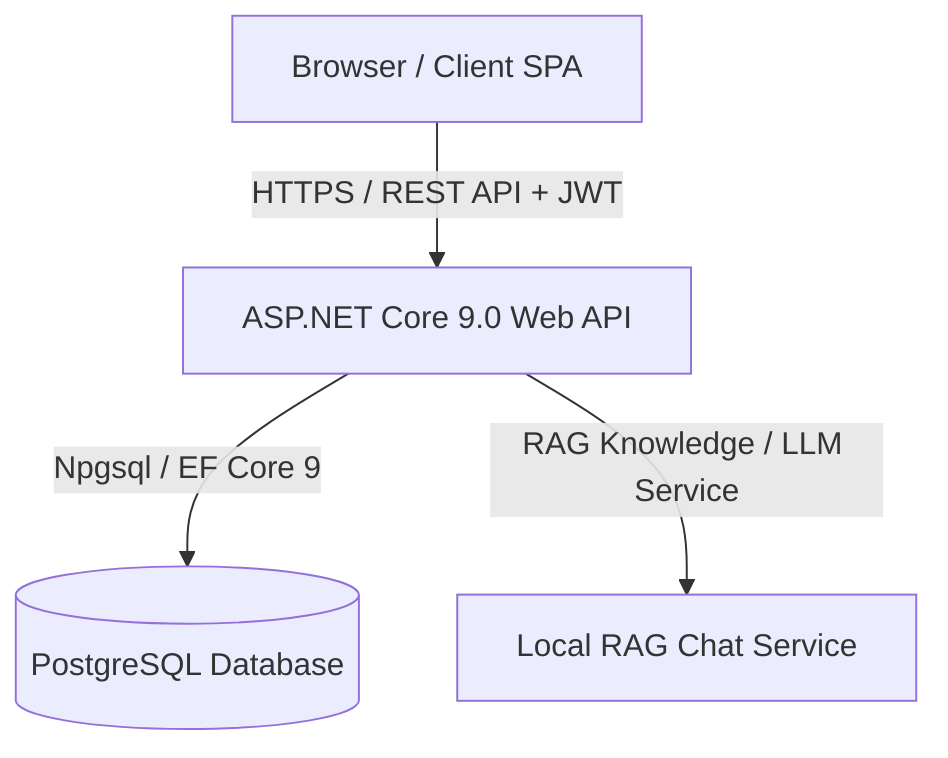

# Technical Stack Documentation

This document outlines the complete technology stack, architectural design, libraries, tools, and infrastructure used across the **GovPortal** project (Frontend & Backend).

---

## 1. System Architecture Overview

The application follows a decoupled client-server architecture:
- **Frontend**: Single Page Application (SPA) built with React 19, TypeScript, and Vite.
- **Backend**: RESTful Web API built on ASP.NET Core (.NET 9.0) with Entity Framework Core and JWT-based authentication.
- **Database**: PostgreSQL relational database with EF Core Code-First migrations.
- **AI / Assistive Service**: In-app AI chat assistance via local Retrieval-Augmented Generation (`LocalRagChatService`).



---

## 2. Frontend Technology Stack

### Core Framework & Build Tools
| Technology | Version | Purpose |
| :--- | :--- | :--- |
| **React** | `^19.2.8` | UI Component Framework |
| **React DOM** | `^19.2.8` | React DOM rendering engine |
| **TypeScript** | `~6.0.2` | Type safety and enhanced developer tooling |
| **Vite** | `^8.3.0` | Ultra-fast build tool and local development server |

### Routing & State / Data Fetching
| Library | Version | Purpose |
| :--- | :--- | :--- |
| **React Router DOM** | `^7.18.4` | Client-side routing, protected routes, and layouts |
| **TanStack React Query** | `^5.103.1` | Server state management, caching, background refetching |
| **Axios** | `^1.20.0` | HTTP client for interacting with backend REST endpoints |

### UI, Styling & Design System
| Library | Version | Purpose |
| :--- | :--- | :--- |
| **Tailwind CSS** | `^4.3.3` | Modern utility-first CSS framework (v4 engine) |
| **@tailwindcss/vite** | `^4.3.3` | Vite integration plugin for Tailwind CSS |
| **Lucide React** | `^1.47.0` | Modern, consistent iconography |
| **clsx** & **tailwind-merge** | `^2.1.1` / `^3.7.0` | Dynamic class merging and conditional styling |
| **Recharts** | `^3.10.1` | Composable charting library for analytics dashboards |

### Forms & Validation
| Library | Version | Purpose |
| :--- | :--- | :--- |
| **React Hook Form** | `^7.88.0` | High-performance, declarative form management |
| **Zod** | `^3.25.76` | Schema declaration and data validation |
| **@hookform/resolvers** | `^5.9.1` | Integration between React Hook Form and Zod |

### Internationalization & Utilities
| Library | Version | Purpose |
| :--- | :--- | :--- |
| **i18next** & **react-i18next** | `^26.4.2` / `^17.0.14` | Multi-language localization and translation support |
| **uuid** | `^14.0.2` | Universally unique identifier generator for client-side entities |
| **Oxlint** | `^1.81.0` | High-speed JavaScript/TypeScript linter |

---

## 3. Backend Technology Stack

### Framework & Runtime
| Technology | Version | Purpose |
| :--- | :--- | :--- |
| **.NET** | `9.0` | High-performance cross-platform developer platform |
| **ASP.NET Core Web API** | `9.0` | Framework for building RESTful web services and controllers |
| **C#** | `13.0` | Modern, type-safe, object-oriented language |

### Database & ORM
| Library / System | Version | Purpose |
| :--- | :--- | :--- |
| **PostgreSQL** | Relational DB | Primary database engine for relational persistence |
| **Microsoft.EntityFrameworkCore** | `9.0.0` | Object-Relational Mapper (ORM) |
| **Npgsql.EntityFrameworkCore.PostgreSQL** | `9.0.0` | PostgreSQL provider for EF Core |
| **Microsoft.EntityFrameworkCore.Design** | `9.0.0` | Design-time tools for generating migrations and database scaffolding |

### Security & Authentication
| Library | Version | Purpose |
| :--- | :--- | :--- |
| **Microsoft.AspNetCore.Authentication.JwtBearer** | `9.0.0` | JWT authentication middleware and token verification |
| **BCrypt.Net-Next** | `4.2.0` | Secure password hashing with salt generation |
| **Role-Based Access Control (RBAC)** | Built-in | Role authorization policies across Citizens, Admins, and Officials |

### Core Controllers & Modules
- **`AuthController`**: User registration, login, JWT issuance, and authentication verification.
- **`ChallengesController`**: Management of civic issues, challenges, workflows, and status transitions.
- **`StartupChallengesController`**: Incubation, innovation, and startup challenge coordination.
- **`UsersController`**: Profile management and user directory queries.
- **`KnowledgeController`**: Public knowledge base articles, FAQs, and official documentation.
- **`ChatController`**: Interactive query processing using the `IChatService` / `LocalRagChatService`.

### Configuration & Utilities
| Library | Version | Purpose |
| :--- | :--- | :--- |
| **DotNetEnv** | `3.2.0` | Environment variable management via `.env` files |
| **System.Text.Json** | Built-in | High-throughput JSON serialization / deserialization |

---

## 4. Infrastructure, DevOps & Deployment

| Layer | Technology | Details |
| :--- | :--- | :--- |
| **Frontend Hosting** | **Netlify** | Static SPA hosting configured via `netlify.toml` with client-side routing fallback (`/* -> /index.html`) |
| **Backend Hosting** | Any .NET 9 runtime (Docker / Cloud VM / App Service) | Kestrel-powered self-hosted web server with HTTPS redirection and configurable CORS |
| **Database Hosting** | Managed PostgreSQL (e.g. Supabase, Neon, AWS RDS, Azure) | Connected via `DefaultConnection` string |
| **Version Control** | **Git** | Distributed version control tracking project repository |

---

## 5. Development & Build Workflow

### Prerequisites
- **Node.js**: `v20.x` or `v22.x` (LTS recommended)
- **.NET SDK**: `9.0.x`
- **PostgreSQL**: `v15+` or hosted instance

### Running the Frontend
```bash
cd frontend
npm install
npm run dev
```

### Running the Backend
```bash
cd backend
dotnet restore
dotnet ef database update
dotnet run
```
